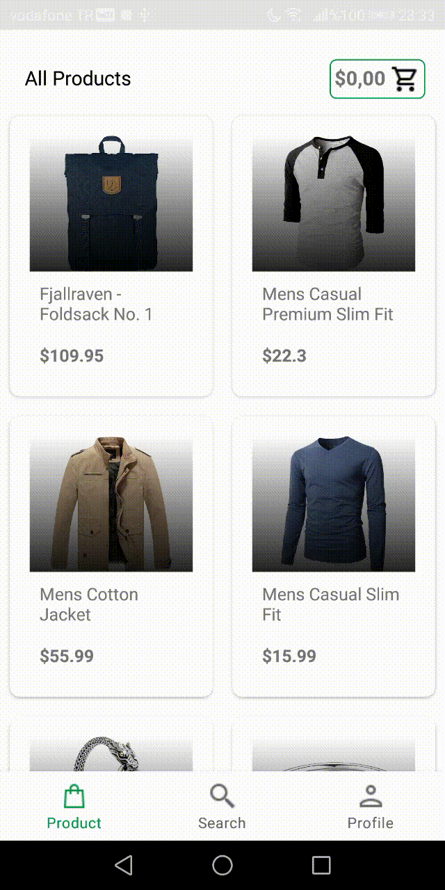
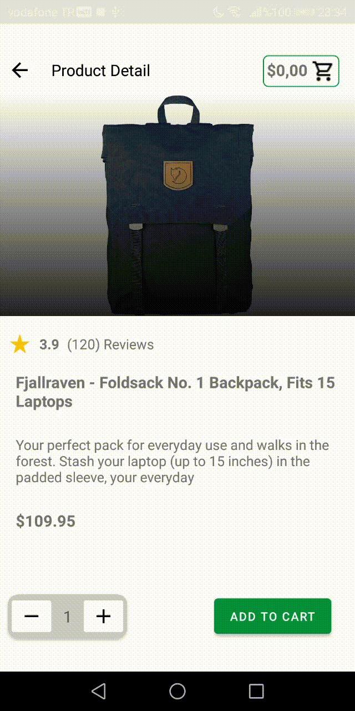
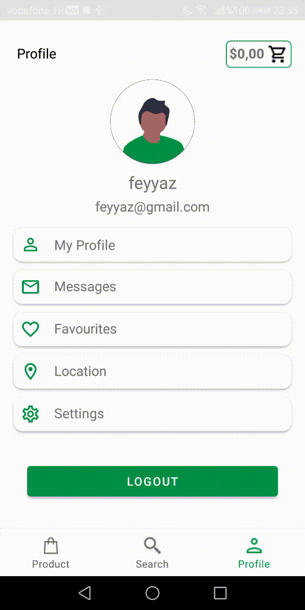

# Shopping App

## ✨ Project Images
| Main Screens | Basket |  Authentication | 
|:-:|:-:|:-:|
|  |  |  |

## 🌟 About The Project

This project is a shopping application. Fake Store API is used for the products shown in the application. You can register for the application using FirebaseAuth, list the products by categories, see the product details and add the products to the cart.

  
## 📦 Architecture

The application was developed with the Kotlin programming language. MVVM (Model-View-ViewModel)Architecture Pattern and Repository Design Pattern were used for data access and data management to be in a single point within the application.
## 🧰 Libraries Used

#### Architecture Compenents and Jetpack Libraries

* [Hilt](https://developer.android.com/training/dependency-injection/hilt-android) 
* [Navigation](https://developer.android.com/guide/navigation)
* [Lifecycle](https://developer.android.com/jetpack/androidx/releases/lifecycle)
* [Data Binding](https://developer.android.com/topic/libraries/data-binding/)
* [View Binding](https://developer.android.com/topic/libraries/view-binding)
* [ViewModel](https://developer.android.com/topic/libraries/architecture/viewmodel)

#### Third Party Libraries

* [Kotlin Coroutines](https://developer.android.com/kotlin/flow)
* [Flow](https://developer.android.com/kotlin/flow)
* [Gson](https://github.com/google/gson)
* [Retrofit](https://github.com/square/retrofit)
* [OkHttp](https://square.github.io/okhttp/)
* [Picasso](https://github.com/square/picasso)
* [Lottie](https://github.com/airbnb/lottie-android)
* [Firebase Auth](https://firebase.google.com/docs/auth)
* [Cloud Firestore](https://pub.dev/packages/cloud_firestore)
    
  
## 📃 Features

- User can register with FirebaseAuth.
- You can see the detail information of the desired product on the detail page.
- You can add the desired product to the cart. 
- The data of the products added to the cart are kept separately for each user in the firestore.
- You can set the product quantity on the cart page.
- You can perform transactions with the buy button on the cart page. In this way, it can ensure that the basket is emptied.
- The user can exit the account by pressing the logout button on the profile page.

  
## 📩 Contact

- [Linkedin](https://www.linkedin.com/in/feyyazatman/)
- Email : feyyaz.atman.00@gmail.com

  
